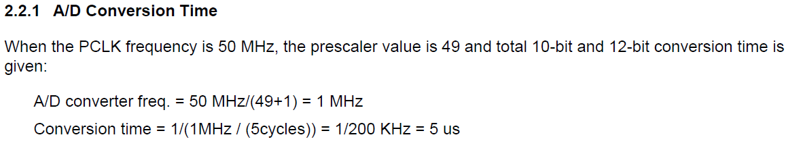
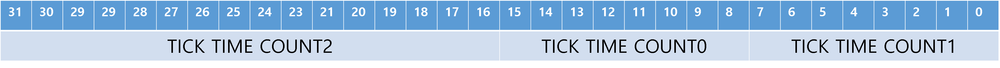

# ASM-Project

# 프로젝트 주제

보드에 있는 가변저항을 돌려서 주어진 시간내에  목표 값을 맞추는 게임을 만들어 보았다.

# 주요 기능

1. ADC를 초기화 하고 값을 읽어온다.
2. RTC를 초기화 하고 TICK 인터럽트를 살린다.
3. ADC값을 주어진 값과 같은지 비교한다.
4. 주어진 시간(5초)내에 값을 맞춘다면 성공, 못 한다면 실패
5. 성공했다면, 다시 게임이 시작된다.
6. 만약, 실패했다면, 버튼을 눌러서 다시 시작하게한다.

# 기능별 코드

## ADC 초기화

    ADC_INIT:
    	sub sp,sp,#4
    	stmfd sp!,{r0-r2}
    
    	ldr r0,=0x58000000
    	ldr r1,=0x4C48
    	str r1,[r0]
    
    	ldr r0,=0x58000018
    	ldr r1,=0x0
    	str r1,[r0]
    
    	ldr r0,=0x58000000
    	ldr r1,=0x1
    	str r1,[r0]
    
    	ldmfd sp!,{r0-r2}
    	mov pc,lr

ADCCON : 0x58000000 ⇒ ADC 제어 레지스터

[15] : ECFLG : 변환플래그, 0 = A/D 변환중, 1 = A/D 변환 완료

[14] : PSCEN : 프리스케일러 사용 여부, 0 = 사용 안함, 1 = 사용함

[13 : 6] : PRSCVL : 프리스케일러 값 (5 ~ 255)

[5 : 4] : X

[3] : RESSEL : ADC 분해능 선택, 0 = 10비트 분해능, 1 = 12비트 분해능
※분해능은 얼마나 아날로그에 가깝게 만들 수 있는지를 나타내는 값이므로 클수록 좋다. 

[2] : STDBM : 스탠바이 모드 선택, 0 = 일반 동작모드, 1 = 스탠바이 모드

[1] : READ_START : 읽는 동작으로부터 A/D 변환을 시작, 0 = 비활성화, 1 = 활성화 

[0] : ENABLE_START : 이 비트를 세팅하면 A/D 변환을 시작, 0 = 비활성화, 1 = 활성화

0x4C48 : 0b0100 1100 0100 1000 
⇒ 프리스케일러 사용, 프리스케일러 값 49 ( 그 이유는 아래 사진 참고), 12비트 분해능

ADCMUX : 0x58000018 ⇒ ADC 채널 선택 레지스터

[3 : 0] : ADCMUX : 아날로그 입력 채널 선택

0000 = 0x0 = AIN0, 0001 = 0x1 = AIN1, 0010 = 0x2 = AIN2,
0011 = 0x3 = AIN3, 0100 = 0x4 = AIN4, 0101 = 0x5 = AIN5,
0110 = 0x6 = AIN6, 0111 = 0x7 = AIN7, 1000 = 0x8 = AIN8,
1001 = 0x9 = AIN9

0x0 : 0b0000

⇒ AIN0 채널 사용

## ADC 값 읽기

    ADC_READ:
    	ldr r0,=0x58000000
    	ldr r1,=0x4C49
    	str r1,[r0]
    
    	ldr r2,=0x5800000C
    	ldr r3,=0x0FFF
    	ldr r0,[r2]
    	and r0,r0,r3
    
    	mov pc,lr

윗부분의 코드는 위의 초기화 코드와 같으나 혹시나 몰라서 추가한 코드이므로 없어도 무방하다

ADCDAT0 : 0x5800000C ⇒ ADC 변환 값 레지스터

[15] : UPDOWN : Stylus 상태, 0 = DOWN, 1 = UP

[14] : AUTO_PST : 자동 포지션 변환, 0 = 일반 ADC, 1 = 자동 X, Y 포지션 계산

[13 : 12] : XY_PST : 수동 포지션 측정, 00 = 명령 없음, 01 = X 좌표 측정, 10 = Y 좌표 측정, 11 = INT 대기

※ 터치스크린의 터치 부분을 처리하는 부분 또한 ADC로 제어하기 때문에 X, Y 좌표값이 존재한다.

[11 : 10] : XPDATA_12 : 분해능이 12비트일 때의 X좌표와 일반 ADC MSB 2비트 변환 값

[9 : 0] : XPDATA : X좌표와 일반 ADC 변환 값

ADCDAT0의 하위 12비트(12비트 ADC 변환 값)를 가져오기 위해 0x0FFF와 AND 연산한다.

## RTC 초기화

    RTC_INIT:
    	sub sp,sp,#4
    	stmfd sp!,{r0-r2}
    	
    	ldr r0,=0x57000040
    	ldr r1,=0x1C0
    	str r1,[r0]
    
    	ldr r0,=0x57000044
    	ldr r1,=0x80
    	str r1,[r0]
    
    	ldr r0,=0x5700004C
    	ldr r1,=0x1
    	str r1,[r0]	
    
    	ldr r0,=0x57000048
    	ldr r1,=0x0
    	str r1,[r0]
    
    	ldmfd sp!,{r0-r2}
    	mov pc,lr

RTCCON : 0x57000040 ⇒ RTC제어 레지스터

[8 : 5] : TICsel2 : RTC 틱 선택 2, 0 : 1/16384 초 주기, 1 : 1/8192 초 주기, 2 : 1/4096 초 주기, 3 : 1/2048 초 주기, 4 : 1/128 초 주기, 5 : 1 초 주기, 6 : 1/1024 초 주기, 7 : 1/512 초 주기, 8 : 1/256 초 주기, 9 : 1/64 초 주기, 10 : 1/32 초 주기, 11 : 1/16 초 주기, 12 : 1/8 초 주기, 13 : 1/4 초 주기, 14 : 1/2 초 주기

[4] : TICsel : RTC 틱 선택1, 0 : TICsel2로 선택, 1 : 1/32768 초 주기(디폴트 값)

[3] : CLKRST : RTC 클럭 카운트 리셋, 0 : 리셋 안함, 1 : 리셋 

[2] : CNTSEL : BCD 카운트 선택, 0 : BCD 카운트 사용, 1 : 예약된 기능

[1] : CLKSEL : BCD 클럭 선택, 0 : XTAL 1/215 클럭 사용, 1 : 예약된 기능

[0] : RTCEN : RTC 제어 활성화, 0 : 비활성화, 1 : 활성화

0x1C0 : 0b0001 1100 0000
⇒ 1/2 초 주기 틱, TICsel2로 주기 선택, RTC 제어 비활성화(자동으로 RTC 실행, 시간을 설정하려면 1 )

TICINT0 : 0x57000044 ⇒ RTC 틱 타임 카운트 값 레지스터0

[7] : TICK INT Enable : 틱 타임 인터럽트 활성화, 0 : 비활성화, 1 : 활성화

[6 : 0] : TICK Time Count0 : 32비트 틱 타임 카운트 값의 [14 : 8] 비트 값

TICINT1 : 0x5700004C  ⇒ RTC 틱 타임 카운트 값 레지스터1

[7 : 0] : TICK Time Count1 : 32비트 틱 타임 카운트 값의 하위 8 비트 값

TICINT2 : 0x57000048  ⇒ RTC 틱 타임 카운트 값 레지스터2

[16 : 0] : TICK Time Count1 : 32비트 틱 타임 카운트 값의 상위 17 비트 값

32비트 틱 타임 카운트 구성

틱 타임 카운트 값을 1으로 하여서 1초에 한번씩 틱이 초기화 되게 한다.

1/2 초 주기에서 1/2초에는 0 2/2 초에는 1,  1과 1/2초에는 2로 바뀌기 때문에 1로 세팅해서 1이되면 다시 0이 되게함 

## RTC 틱 인터럽트 초기화

 

    RTC_INT_INIT:
    	ldr r0,=INTMOD1
    	ldr r1,=0x0
    	str r1,[r0]
    
    	ldr r0,=INTMSK1
    	ldr r1,=0xFFFFFFFF	
    	str r1,[r0]
    
    	ldr r0,=SRCPND1
    	ldr r1,=0x100
    	str r1,[r0]
    
    	ldr r0,=INTPND1
    	ldr r1,=0x100
    	str r1,[r0]
    
    	ldr r0,=INTMSK1
    	ldr r1,=0xFFFFFEFF
    	str r1,[r0]
    
    	mov pc,lr

인터럽트 모드를 0x0으로 해서 IRQ 모드로 사용함

틱 인터럽트는 SRCPND1 레지스터의 [8]번째에 존재해서 0x100을 써넣어서 틱 인터럽트를 살린다.

인터럽트 펜딩역시 0x100으로 써넣어준다.

같은 느낌으로 0x100을 역수를 취해서 마스킹을 해준다.

## 틱 인터럽트 핸들러

    // 함수 프로토타입
    void __attribute__((interrupt("IRQ"))) RTC_TICK(void);
    
    // Main 함수 내부
    pISR_TICK = (unsigned)RTC_TICK;
    
    // 인터럽트 핸들러 함수
    void __attribute__((interrupt("IRQ"))) RTC_TICK(void){
        ClearPending1(BIT_TICK);
        if(game_flag){
            Uart_Printf("%3d sec\t", ++tick);
            if(random > ADC_READ()){
                Uart_Printf("SMALL\r\n");
            }
            else Uart_Printf("BIG\r\n");    
        }
    }

틱 인터럽트 함수는 매초 호출되며, 게임 플래그가 0이면 게임 카운트 값을 누적하지 않는다.

매초 경과시간을 출력하며, ADC값이 랜덤 값보다 큰지 작은지 비교해 출력 해 준다.

## Main 함수

    int tick = 0;
    uint32_t random = 0;
    int game_flag = 1;
    
    void Main(){
        Uart_Init(115200);
        ADC_INIT();
        RTC_INIT();
        RTC_INT_INIT();
        pISR_TICK = (unsigned)RTC_TICK;
        Uart_Printf("Program Started!!\r\n");
        
        // srand(rTCNTO0);
        random = (rand() % 4094) + 1; 
        Uart_Printf("DST_VAL : %d\r\n",random);
        while(1){
            
            uint32_t result = ADC_READ();
            if(abs(random - result) < 20){
                Uart_Printf("\r\nSuccess\r\n");
                game_flag = 1;
                tick = 0;
                random = (rand() % 4094) + 1; 
                Uart_Printf("DST_VAL : %d\r\n",random);
            }
            if(tick > 4){
                Uart_Printf("\r\nGame Over\r\n");
                Uart_Printf("\r\nIf You Want to Restart, Press the Button0\r\n");
                game_flag = 0;
                while(!BUTTON_IN());
                game_flag = 1;
                tick = 0;
                random = (rand() % 4094) + 1; 
                Uart_Printf("DST_VAL : %d\r\n",random);
            }
        }
    }

전역 변수로 게임 플레이 시간 카운터 값과 게임 상태 플래그를 선언한다.

메인 함수에서는 각종 주변장치들을 초기화한다.

인터럽트를 초기화 할 때, 인터럽트 핸들러에 작성한 핸들러 함수 포인터를 연결시킨다. 

ADC 최고값만큼의 범위로 랜덤을 돌려서 저장해두고, 그 값을 시리얼로 출력한다.

ADC값을 읽어와서 랜덤값에 뺀값의 절대값이 20(난이도를 위해 키움, 원래는 두 값이 같아야 됨) 보다 작으면 성공으로 치고 게임 플래그를 1로 한다.

게임이 정상적으로 계속 진행 될 때 플래그는 항상 1이 된다.

성공한 경우 틱을 초기화하고 다시 게임을 시작한다. 이 때, 새 랜덤 값을 가지고 온다.

만약 5초가 지났는데 성공하지 못했다면, 게임오버를 출력하고 버튼 입력을 받으면 게임을 재개한다.